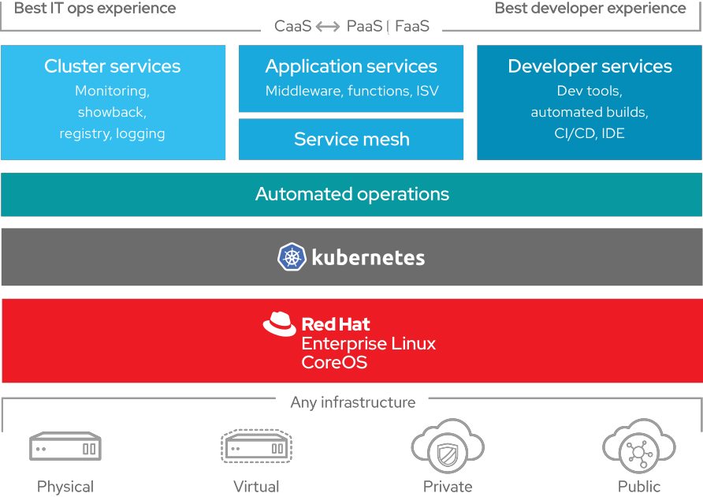

== OpenShift Introduction

{nbsp} +

{nbsp} +

Red Hat helps organizations develop, deploy, and manage existing and container-based applications seamlessly across physical, virtual, and public cloud infrastructures. Built on proven open source technologies, OpenShift helps application development and IT operations teams modernize applications, deliver new services, and accelerate development processes.

OpenShift IT operations a secure, enterprise-grade Kubernetes that provides policy-based control and automation for applications. Cluster services, scheduling, and orchestration provide load-balancing and auto-scaling capabilities. Security features prevent tenants from compromising other applications or the underlying host. And because OpenShift can attach persistent storage directly to containers, IT organizations can run both stateful and stateless applications on one platform. 

image::ocp-features.png[OpenShift Features,800,align="center"]

== Basic Concepts

Kubernetes contains a number of abstractions that represent the state of your system: deployed containerized applications and workloads, their associated network and disk resources, and other information about what your cluster is doing. These abstractions are represented by objects in the Kubernetes API; see the Kubernetes Objects overview for more details.

The basic Kubernetes objects include:

- Container: A container is the smallest compute unit.

image::ocp-container.png[Container,100,align="center"]

- Container registry: Container images are stored in an image registry. OpenShift has a built-in image registry to store images and and also deploy from the registry.

image::ocp-registry.png[Image Registry,500,align="center"]

- Pod: Containers are wrapped in pods which are units of deployment and management.

image::ocp-pod.png[Pod,500,align="center"]

- Deployment: Pods configuration is defined in a deployment.

image::ocp-deployment.png[Deployment,500,align="center"]

- Service: Services provide internal load-balancing and service discovery across pods. Apps can talk to each other via services.

image::ocp-service.png[Service,500,align="center"]

- Routes: Routes add services to the external load-balancer and provide readable urls for the app.

image::ocp-routes.png[Service,500,align="center"]

- Projects (Namespaces): Projects isolate apps across environments, teams, groups and departments.

image::ocp-namespaces.png[Service,500,align="center"]

- Volume: Directory which is accessible to the containers in a pod. It can be provided by different backends, such as nfs, glusterfs and others.

image::ocp-volumes.png[Volumes,300,align="center"]

== Architecture

OpenShift is fully supported anywhere Red Hat Enterprise Linux is. Hybrid deployments across multiple infrastructures can be achieved, but many customers are still adopting OpenShift inside their existing, traditional virtualized environments.

Its architecture is composed of the following types of servers:
- Master Nodes: Keep and understand the state of the environment and orchestrate all activities on the Nodes.
- Nodes: Where end-user Aplicaçãos are run.

image::ocp-architecture.png[Architecture Components,800,align="center"]

